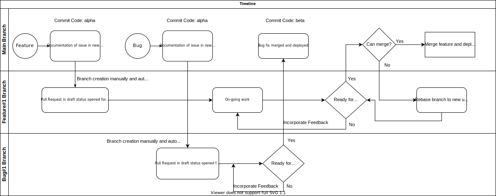

# Salubrios Technologies Release Process

This document is an overview document that will continually undergo revisions as
the team, workload, deployment, services and knowledge + familiarity with
containerization evolves.

Presently this document is a plan for us as a team to have our deployments and
releases be done through a CI/CD pipeline as well as move our applications into
containers.

## Objectives

The objectives for moving to CI/CD are as follows:

1. Moving production credentials outside local systems
   - No production environment on local systems
   - Rotation of credentials through external services like vault, etc.
   - No sharing of production secrets on messaging platforms
2. Automating CI steps to act as guard-rails
   - checking for linting before merging to production
   - checking for security vulnerabilities in builds and deps
   - Using plugins like codeql and similar plugins to keep getting insights on
     code
   - ensure things are building and are ready for working from a container
3. Automate deployments
   - Have deployments be done upon merging code to main branch
4. Increase dependence on tests for prelimiary checks and encourage writing of
   tests
5. Documentation of workflow for better opportunities to receive inputs, suggestions and feedback from team as well as ensuring a process that is easily accessible in the future for new members of the team.
6. Move to a micro-services architecture (over time)

## Challenges

The expected challenges for moving to CI/CD expected are as follows:

1. Deployment to production will probably not be automated easily since we are
   using docker-swarm (see [decision to be revisited](#decisions-to-be-revisited-later))
2. Monitoring and Logging which are not presently an important part of the workflow will become important and external tools might have to be integrated.
3. Possible frustration due to stringent checking (can be avoided with discussion and planning)

## Decisions to be revisited later

1. Using vercel to deploy applications
2. Using docker

## Important Notes

1. No more qa-environment server

## Typical workflow for merging

The typical workflow while working with git at Salubrious Technologies is indicated in the image below

### Pre-requisites

- Creating a branch for an issue/bug and immediately opening a draft PR of it against the main branch

#### Functionality

For every commit to the branch the following steps will be run by GitHub Actions

1.  Linting
2.  - **marketing websites**: creating preview-builds and deploying them to vercel (default to using staging server details in the preview builds if any)

    - **front-end applications**: creating builds, running local tests (unit tests), cypress-testing if applicable (depending on compose to create qa-environment)

    - **backend**: Build image for testing env, run tests, integration tests with cypress (depending on compose to create qa-envrionment)

3.  Vulnerability scans, using Snyk open-source version initially
4.  Codeql for code quality checks

_build_ above refers to creation of image from a dockerfile that can server the application

After all of the above steps are passing, there will be a workflow available for triggering manually to deploy to a staging environment.

Once the staging version is ready for deployment, the production deployment will have to be done afte signing the docker-images following which they will be deployed to production.

## Pending Decisions

- Using different registries for handling staging vs. production images or tagging images to represent different environments.
- Production environment setup and outline

## Next steps:

1. Meeting plan for individual repositories
2. Attempt to get everyone to staging with Github Actions and docker in 2 weeks
