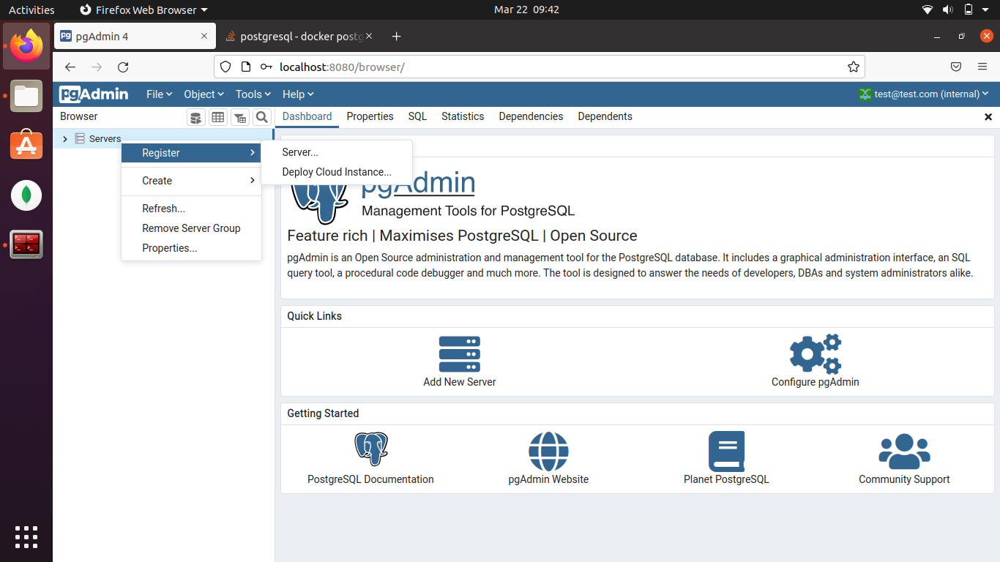
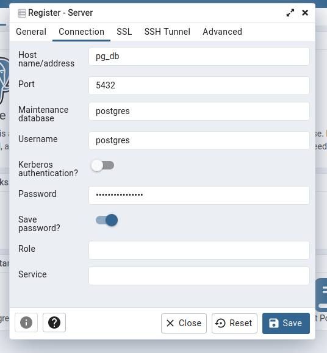

# Getting setup with databases running as docker container for development

1. Create a docker network for the database, this will make it easier for connecting
   tools to the application

```
docker network create db_net
```

2. Start the database container

   - For PG

   ```
   docker run --name pg_db --network db_net -p 5432:5432 \
   -e POSTGRES_USER=postgres \
   -e POSTGRES_PASSWORD=mysecretpassword \
   -d postgres:14
   ```

   **NOTE**: This doesn't include a -v (volume) flag so data is not going to be available
   in case the container is recreated, add the -v flag to persist data even upon recreation
   of the container.
   Additionally you can add the `--restart=always` flag here in case you need the container to come online everytime you restart the system, this saves you from having to run the docker start command upon every restart

   - For Mongo

   ```
   docker run --name mongo_db --network db_net -p 27017:27017 \
   -e MONGO_INITDB_ROOT_USERNAME=mongoadmin \
   -e MONGO_INITDB_ROOT_PASSWORD=secret \
   -d mongo:4
   ```

   _NOTE_: This assumes the default port for each of these databases are free on your system, in case it is not available remember to change the mapping accordingly, so if 5432 is already in use, and you instead want the service to listen at 5433 you can change the -p flag and instead use `-p 5433:5432`.
   Please refer to the documentation for the latest version of each of these images

3. Start the GUI tool for connecting to the database container created earlier

   - For pg_admin

   ```
    docker run --name pg_admin --network db_net -p 8080:80 \
    -e PGADMIN_DEFAULT_EMAIL=test@test.com \
    -e PGADMIN_DEFAULT_PASSWORD=secretpassword \
    -d dpage/pgadmin4
   ```

   - For mongo_express

   ```

   ```

   _NOTE_: The GUI Tools, take some time after the container is started to become fully functional.
   Both the GUI tools have extensive configuration options and it is recommended that in case you are trying to use these with any production server, you review the documentation on their respective pages for connecting.

4. Running the GUI tool
   - For pg_admin
     You can visit the port specified in the previous command on your browser and login with the credentials provided while creating the container in the previous command. Next you can click on the `Server` to add a new server and add the details for connecting to the docker container running postgres.
     
     While adding the details for connection in the window, note that the host address specified is the name of the docker container that was provided at the time of creation of the the postgres docker contianer.
     
